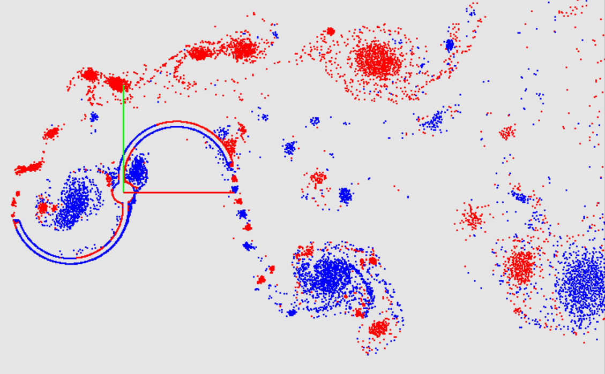
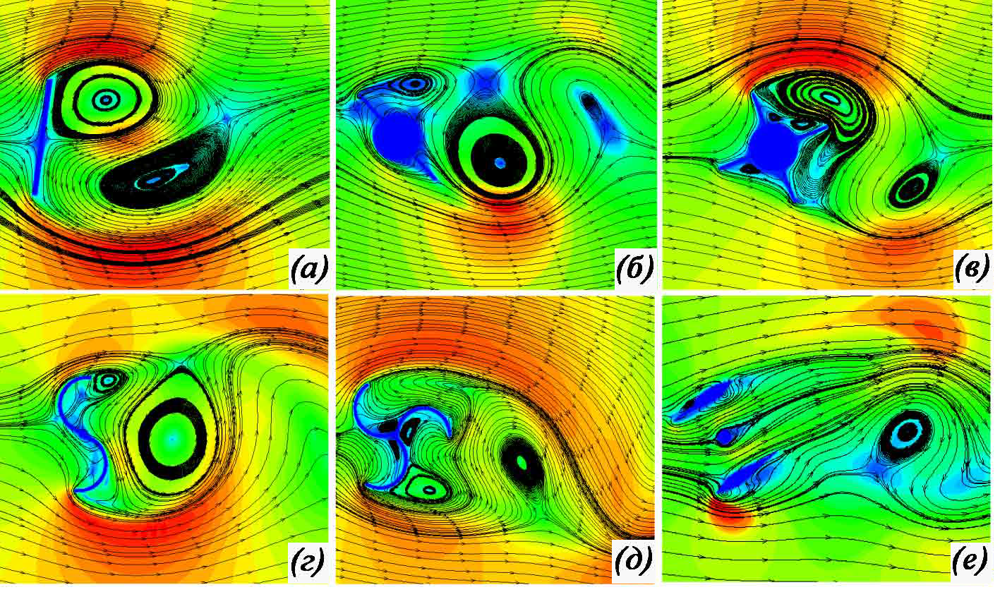
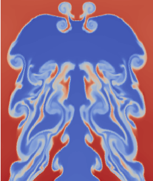

Efficient numerical methods development for unsteady aerohydrodynamic loads computation for aerohydroballistic design of flying vehicles
========================================================================================================================================

It is planned to perform investigations using existent scientific background and experience in 
software development for further development and analysis of the modern methods of computational 
aerohydrodynamics, which are not implemented in known Russian and foreign software packages. Their 
software implementation as fully functional prototypes of the programs adapting to perform 
computations on the modern multiprocessor computers with cluster architecture is also planned.
The considered methods seem to be effective and actual for the following areas.

-----------------------------------------------------------------------------------------------------------
No     Method                                     Method summary
------ ------------------------------------------ ---------------------------------------------------------
1.     { width=75% }    **Vortex method** aerohydrodynamic and coupled fluid structure interaction problems 
                                                  with assumption of flow incompressibility appearing in aerospace 
                                                  engineering (computation of loads acting on the aircraft), in loads 
                                                  computation for the submerged structures, including freely moving 
                                                  and hauled structures, and in other areas: power plant engineering 
                                                  (calculation of vibrations of heat exchanger tubes of power plants 
                                                  during their flow by a coolant), mechanics of structures, buildings and 
                                                  constructions (flow simulation, solving of coupled problems in 
                                                  industrial aerodynamics, environmental assessment problems, etc.)
  
2.     {width=75%}  **Immersed boundary methods** - the flow simulation on the fixed regular mesh, 
                                                  including high-Reynolds flows, involving known RANS, LES and DES-models of turbulence, 
                                                  in the presence of movable, deformable and rotating flowing surfaces that perform arbitrary 
                                                  large displacements; in addition to the main research line (calculation of unsteady loads 
                                                  in the aerohudroballistic design of  the aircrafts), these methods are particularly 
                                                  effective in the calculation of rotating turntables, wind power plants, multi-component 
                                                  streamlined structures (bundles of pipes) with large displacements of separate 
                                                  components, etc.
  
3.     { width=35% }     **Discontinuous Galerkin method** – modeling of complex (including discontinuous and unstable) 
                                                  compressible and incompressible (weakly compressible) flows in the framework of the Eulerian 
                                                  approach, providing both high order approximation of the solution in its smoothness regions 
                                                  and high resolution of discontinuities for modeling the processes of high-speed flow and, 
                                                  if it is necessary, for heat exchange in structural elements of aircraft.
----------------------------------------------------------------------------------------------------------------------

Under the outlined numerical methods authors of this proposal developed and implemented new modifications of corresponding approaches, 
which prove high computational effectiveness for specified problems. Investigations of parallelization and algorithms adaptation 
for providing computations on the multiprocessor computers also were performed.