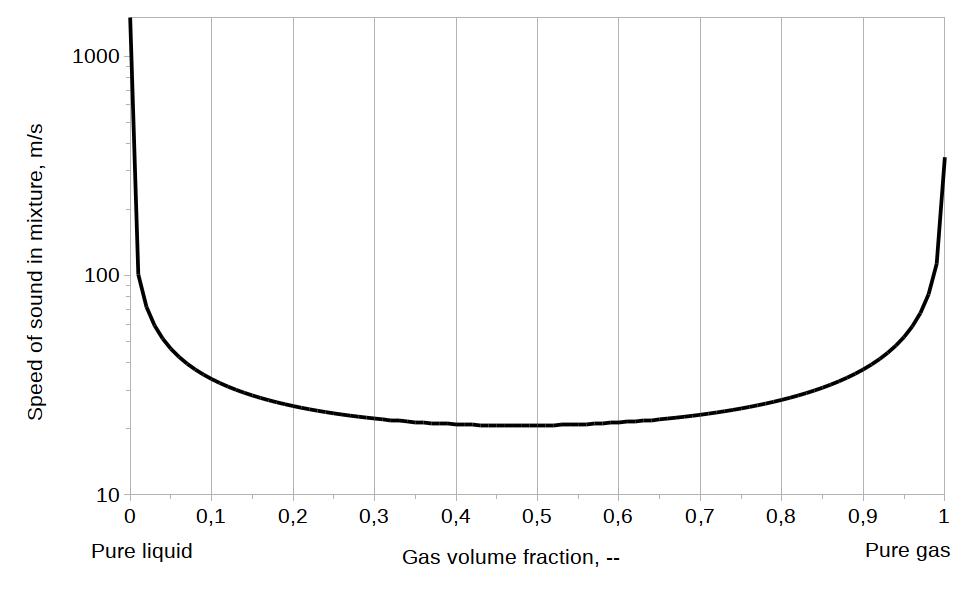
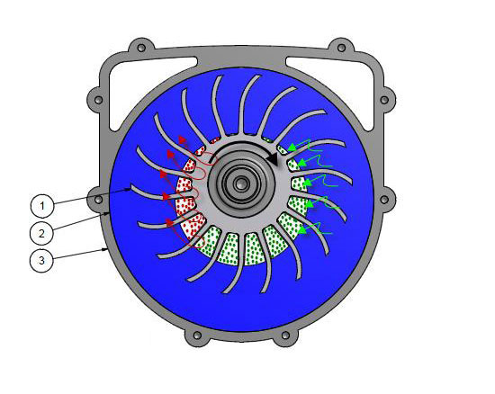
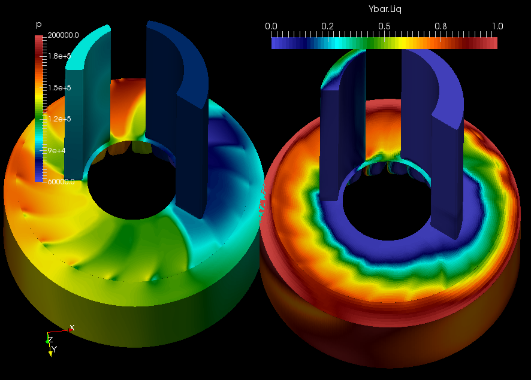
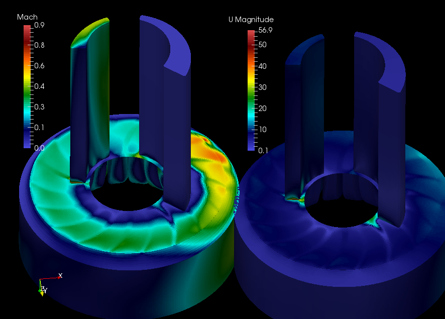

The Numerical Model of Liquid Ring Vacuum Pump
=====================================================

Mathematical modeling of compressible homogeneous two-phase flows is one of the most actual problems. Such models can be useful for the preestimation of integral characteristics of devices where fluid flows with large difference of densities (e.g. water and air) are mixed. Also compressible models allows to estimate pressure fluctuations and, therefore, to predict acoustic loads.  

[The hybrid method of modelling of compressible flows](../../3/En/001-Ru-hybridCentralSolvers.html) was adapted for simulation of two-phase compressible flows of homogeneous fluid mixtures with one-velocity approximation. Mathematical model consists of the mass, momentum, energy equations and the additional transport equation for the mass fraction $Y_{Liq}$ of liquid phase:

\begin{equation*}
\frac{\partial \rho Y_{Liq}}{\partial t} + \nabla \cdot \left ( \vec U \rho Y_{Liq} \right ) = 0
\end{equation*}

The density $\rho$ of a mixture is defined as:

\begin{equation*}
\rho = 
\left (
\dfrac{Y_{Liq}}{\rho_{Liq}}
+
\dfrac{Y_{Gas}}{\rho_{Gas}}
\right )^{-1},
\end{equation*}
where $\rho_{Liq}$, $\rho_{Gas}$ are the densities of mixture components, $Y_{Liq}$, $Y_{Gas}$ are mass fractions of components. Indices "Liq" and "Gas" marks the liquid and gas components of the two-phase mixture respectively.

An isentropic speed of sound in the considered mixture is calculated as:

\begin{equation*}
c 
=
\sqrt {\gamma \frac{\partial p}{\partial \rho}}
=
\sqrt
{
\frac{\gamma}{\rho^2}
\left ( 
\frac{Y_{Liq}}{\rho_{Liq}^2} \frac{\partial \rho_{Liq}}{ \partial p}
+ \frac{Y_{Gas}}{\rho_{Gas}^2} \frac{\partial \rho_{Gas}}{ \partial p}
\right )^{-1}
}
\end{equation*}

Then the equation of state for the homogeneous liquid-gas mixture is the non-monotonic dependency on the gas volume fraction (see fig. below). For example, in the homogeneous vapor-water mixture the sound speed is changed from the know values of sound speed for each pure component (350 m/s for vapor, 1500 m/s for water) to small values of order 20 m/s (in case of equal values of volume fractions) in standard conditions.

 
*The sound speed in the "vapor-water" mixture in dependency of the gas volume fraction*

One application of considered model is the modeling of liquid ring pumps which can be used, for example, in the power engineering. Usually incompressible models or equations of state (e.g. polytropic EoS) are used for simulations of processes in such devices. However the correct calculations of the speed of sound can be important, for example, in problems of noise prediction.

The main principle of the water ring pump operation is based on the balance of mass and momentum. The rotor (1) is slightly offset from the center of cylindrical stator (3). When the rotor moves the liquid ring formed by a centrifugal force (see fig. below). Liquid moves away from the rotor hub to create a suction effect, and the cells of gas are created between the rotor blades. As the cell passes the bottom of the chamber, the liquid begins pressing in towards the rotor hub. This causes the air to be forced out of the cell, filling it with liquid ready for the next suction cycle.

{width=35%} 

*Scheme of the water ring pump: blue region — water ring, white region — air cells between rotor blades, green dots — fluid inflow, red dots — fluid outflow*

The pump construction by Dr. Jörn Beilke was chosen as a test case. The sliding interfaces technology was used. The data interpolation between rotating and static parts of meshes was implemented using the interpolating surfaces. It is necessary to make a gap between corresponding parts, the thickness of gap can be defined in the documentation or can be chosen sufficiently thick to decrease computational time (the gap is thinner the computational time is more).

At the initial time point the liquid distribution in the flow domain corresponds to its position in the real pump when the pump works in the nominal power. The angular velocity of the rotor shaft changes from 0 to 200 rad/s as step function and the pressure in the suction decreases from 100 kPa to 60 kPa.

The results of computations (distribution of pressure, velocity, mass and volume fractions in the pump) are presented in the figure below. The obtained pump capacity is equal to 5 m3/h when the angular velocity of rotor shaft is 200 rad/s and the pressure differential is 40 kPa. Experimental estimation of the pump capacity is 16 m3/h for shaft angular velocity 298 rad/h  and the pressure differential 40 kPa. Therefore, the qualitatively correct simulation of effects in the pump are obtained because:

+ the pump capacity should decrease at least a third when the angular velocity is decreased
  from 298 rad/s to 200 rad/s and the pressure ratio stays the same;
+ the gap between rotor and inflow/outflow nozzles in the real construction is significantly less than the gap in the numerical model which can be the reason of some numerical leaks.

Also the qualitative analysis of the simulated flow shows the transonic zones in regions where the volume fraction of air is 50%.

{width=25%} 

{width=25%} 

*The flow in the water ring vacuum pump, from left to right: static pressure field, mass fraction of liquid, effective Mach number, velocity magnitude field*

Therefore, effects typical for transonic and supersonic flows can be modeled for fluids with sufficiently small velocities using the mathematical model of compressible homogeneous two-phase fluid with non-monotonic equation of state.

Visualisation of flow inside the water ring vacuum pump
-------------------------------------------------------

<iframe width="640" height="480"
src="https://www.youtube.com/embed/xCAaAHuSxSE">
</iframe>