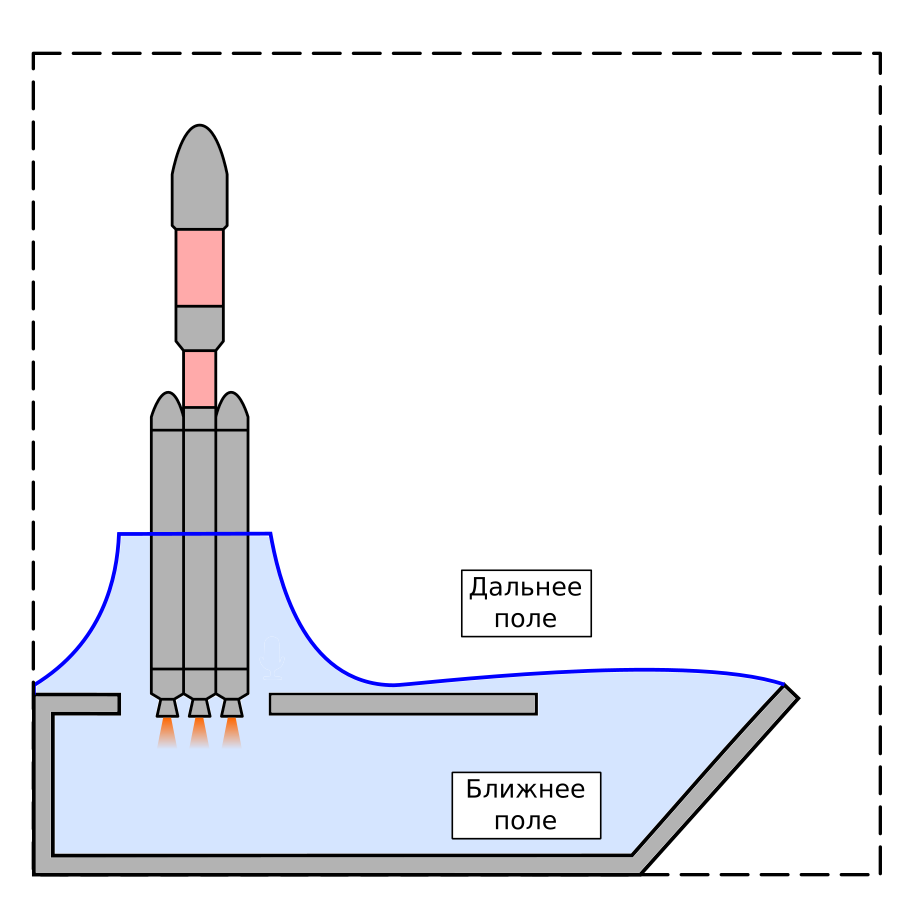
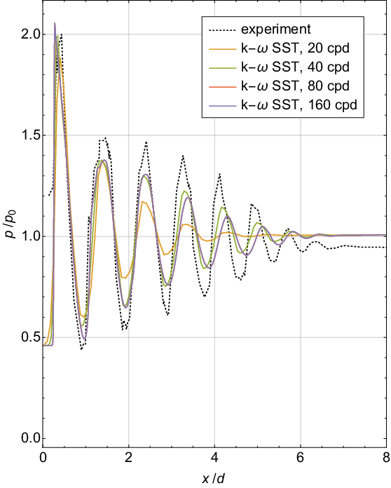
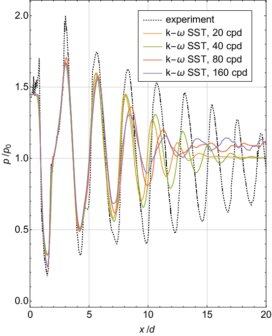
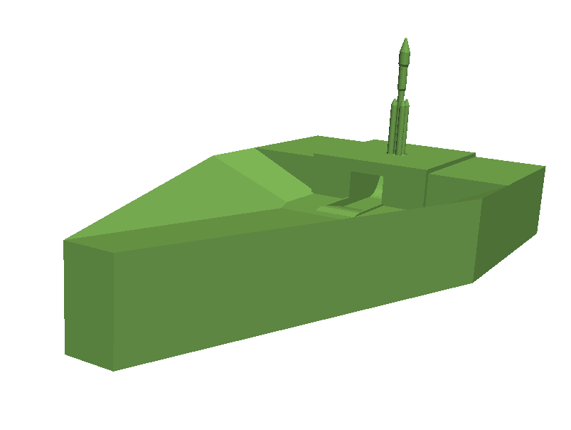
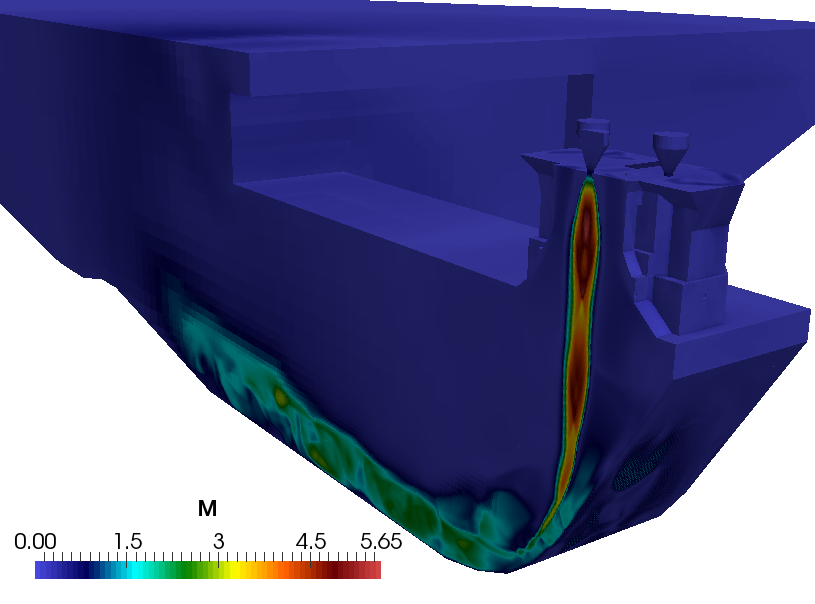
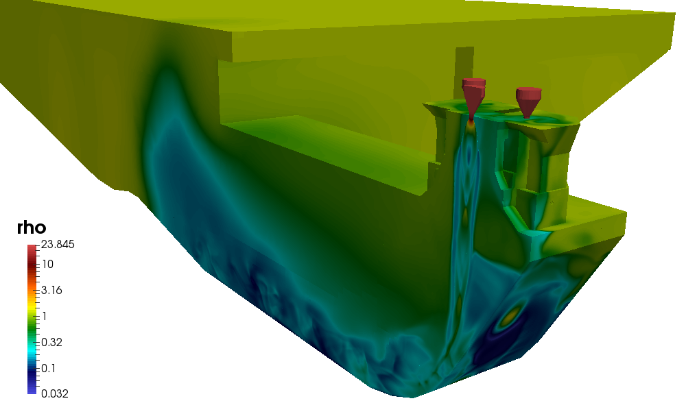
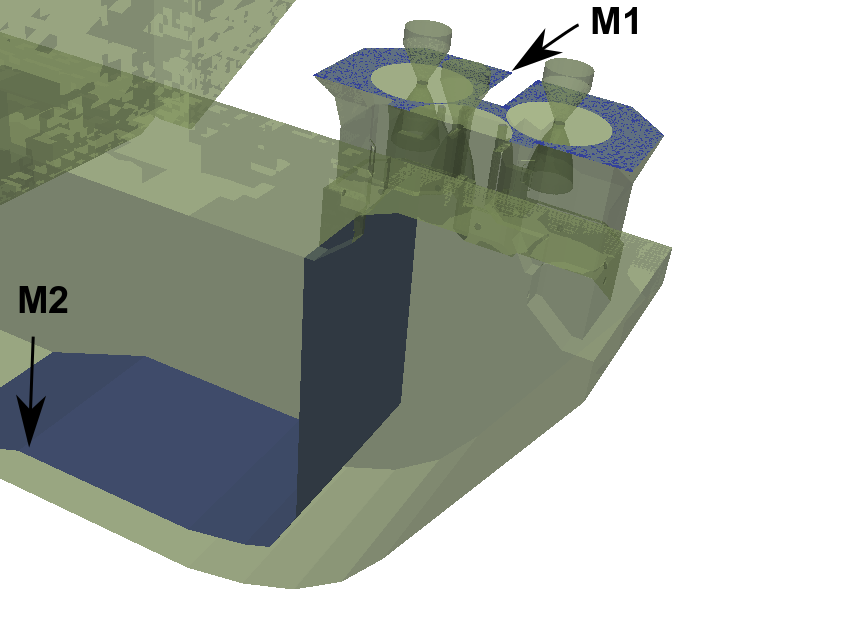
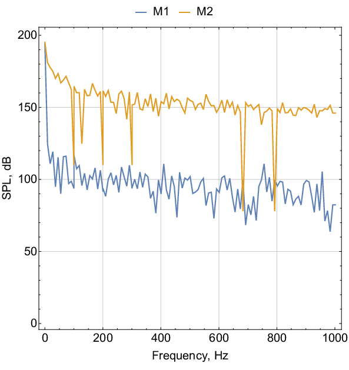

Моделирование газодинамики и акустики старта ракеты-носителя
============================================================

Актуальность проблемы моделирования процессов газовой динамики и акустики при старте ракеты-носителя 
сложно переоценить в связи с возросшим интересом
к ракетам тяжелого класса (Atlas-V, Falcon-9, Antares, Ariane-5, Энергия). Для подобных сооружений особенно остро стоит
проблема подавления акустического шума, особенно с учетом
возникающих из условий географии, стоимости и сложности работ ограничений габаритов
стартовых сооружений. 

Очевидно, что в силу сложности и уникальности объекта полномасштабное физическое
моделирование невозможно. Для повышения точности результатов физического масштабного моделирования 
требуется проведение исследований для
различных масштабов (1:50, 1:5 и т.д.), что приводит к существенным финансовым затратам
и росту времени проектирования. Таким образом, численное моделирование газовой динамики и акустики процессов
старта РН во многом становится единственным инструментом априорного анализа
проектируемых стартовых комплексов.

Сложность газодинамического моделирования в таких задачах обуславливается
разнообразием происходящих процессов и многомасштабностью
задачи. Объем пространства моделирования определяется габаритами стартового стола и сооружений,
составляющих порядка сотни метров по каждому направлению, в то время как характерный
размер расчетной сетки по пространству может составлять величину порядка 0.01 м. Таким
образом, число неизвестных в задаче будет составлять величину порядка $10^12 \ldots 10^13$ , что
делает предъявляемые требования к вычислительным мощностям невыполнимыми в
обозримом будущем.

Для решения таких задач используют гибридный подход, предполагающий разделение области моделирования на т.н. ближнее и дальнее поля (см. рис. ниже). 
В полностью нелинейной постановке газодинамическая задача решается только в
ближнем поле (отмечено светло-голубым цветом); в остальной части расчетной
области решаются линеаризованные уравнения, сводящиеся к уравнению распространения
акустических колебаний. Решение задачи на границе первой области – на поверхности,
обозначенной синей линией – является исходными данными для задачи во второй
области. 

{width=20%}

Для обеспечения надлежащего качества решения требуется оценить размер ячеек
сетки – сеточное разрешение. Оно определяется путем решения модельных задач, имеющих
известное аналитическое решение или тщательно исследованных экспериментально и
численно. Применительно к данной задаче необходимо такое сеточное разрешение, которое
позволит корректно воспроизводить газодинамические процессы истечения сверхзвуковых
струй из сопел РН и распространение акустических волн давления.

Для численного решения задачи в ближнем поле был выбран [гибридный метод
решения уравнений газовой динамики](../../3/Ru/001-Ru-hybridCentralSolvers.html), позволяющий моделировать течения в широком
диапазоне чисел Маха. Перед проведением трехмерного расчета были сделаны предварительные оценки размеров ячеек сетки, 
требуемых для корректного моделирования турбулентных сверхзвуковых струй. Для этого были проведены расчеты
для выбранных [тестовых задач](https://ntrs.nasa.gov/search.jsp?R=19820025274) для недорасширенной и перерасширенной струй.   

{width=20%}
{width=20%}

*Демонстрация сеточной сходимости для решения тестовой задачи моделирования истечения холодной струи из сопла заданного профиля, слева направо: для недорасширенной и перерасширенной струй*

Из графиков видно, что решение удовлетворительно согласуется с экспериментом для
первых двух «бочек» при сеточном разрешении от 80 ячеек на диаметр. Выбрав за
основную Сетку 3 и задавшись характерным размером диаметра сопла порядка 1.5 м,
получаем, что максимальный шаг по пространству, необходимый для воспроизведения
сверхзвуковых струй, равен $h_{max}$ = 0.018 м.

На основании имеющихся оценок было проведено моделирование истечения турбулентных струй из пяти сопел заданной конфигурации, установленных на стартовом столе заданной геометрии (см. рис. ниже). Сеточное разрешение подбиралось таким образом, чтобы разрешить частоты колебания давления до 1000 Гц; шаг по пространству в области течения сверхзвуковых струй составил $h$ = 0.01 м. С целью уменьшения итогового размера сетки моделировалась половина газохода, выбранная относительно его плоскости симметрии. Итоговый размер сетки составил около 35 млн ячеек. 

{width=35%}

*Упрощенная модель ракеты-носителя и стартового стола, созданная в SALOME* 

На следующих изображениях продемонстрированы результаты газодинамического расчета в ближнем поле (распределение поля плотности и числа Маха), а также пульсации уровня звукового давления в указанных точках внутри газохода, соответствующие моменту времени 0.2 с. Отметим, что высокоинтенсивные акустические нагрузки порождаются прежде всего сверхзвуковыми турбулентными струями, проходящими через весь газоход. Таким образом, граница между ближним и дальним полем будет проходить вне газохода и охватывать достаточно большую область.

{width=30%}
{width=35%}

*Распределение плотности газа и числа Маха при старте ракеты-носителя. Физическое время: 0.2 с* 

{width=35%} 
{width=25%}

*Уровень звукового давления в указанных точках внутри газохода*